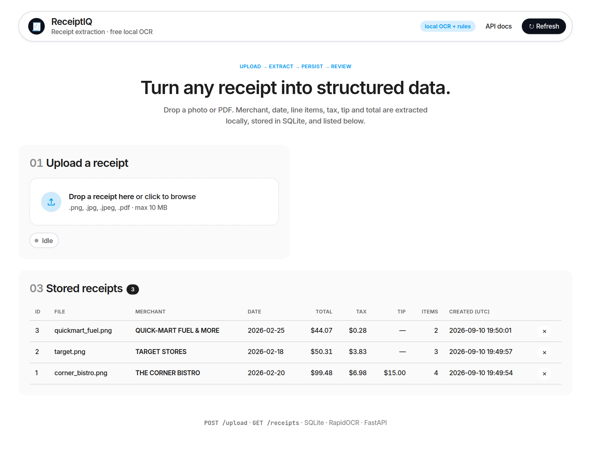
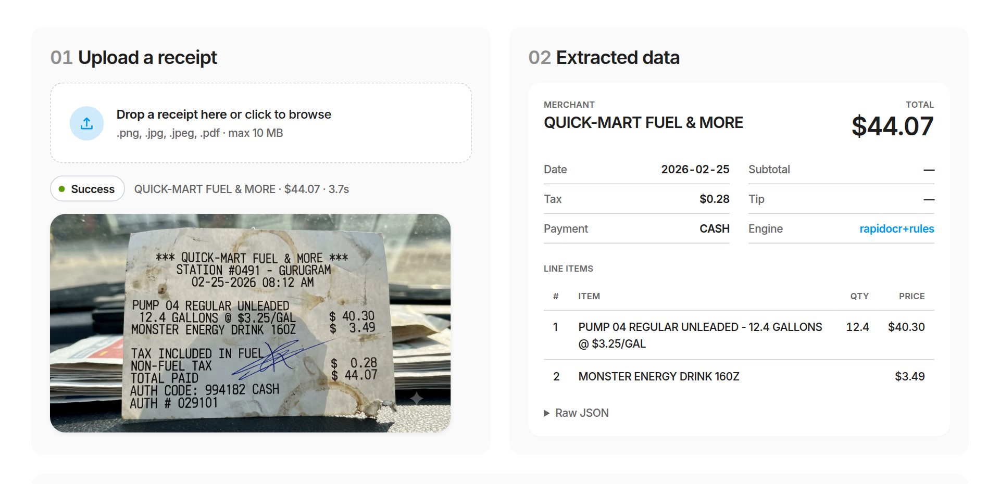
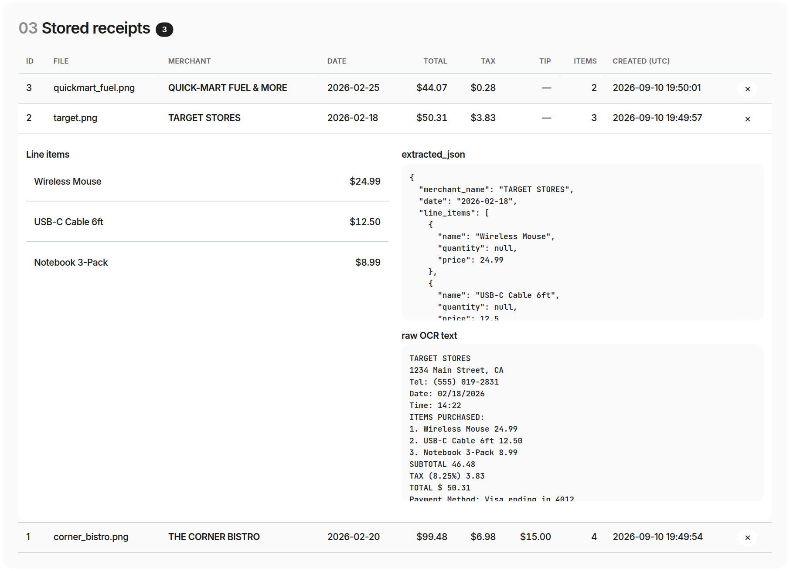
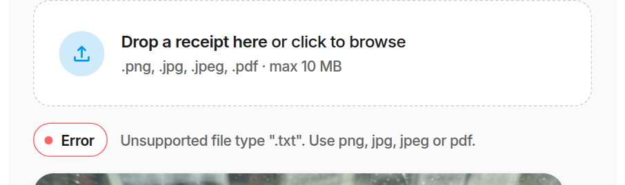
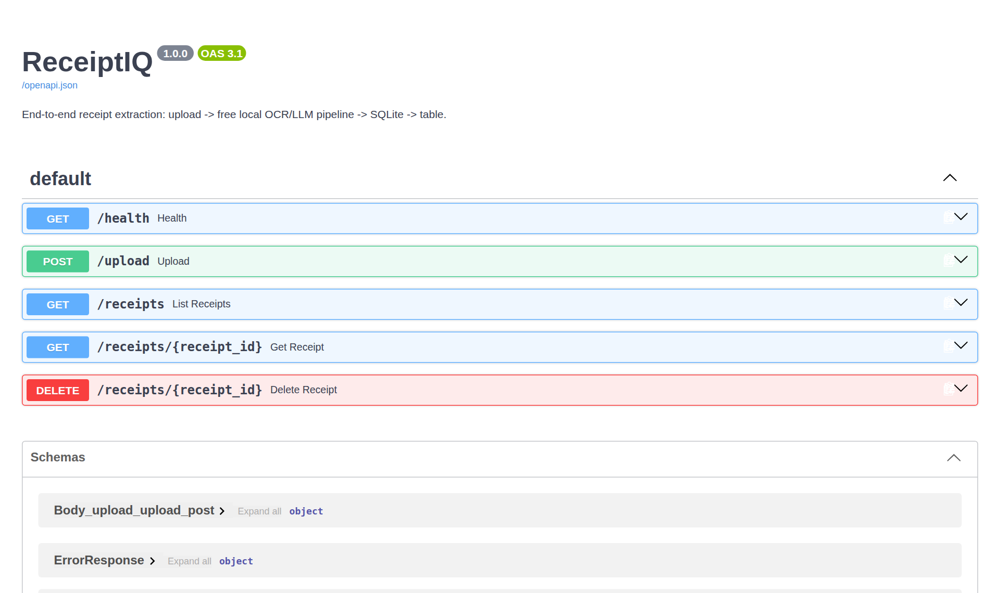
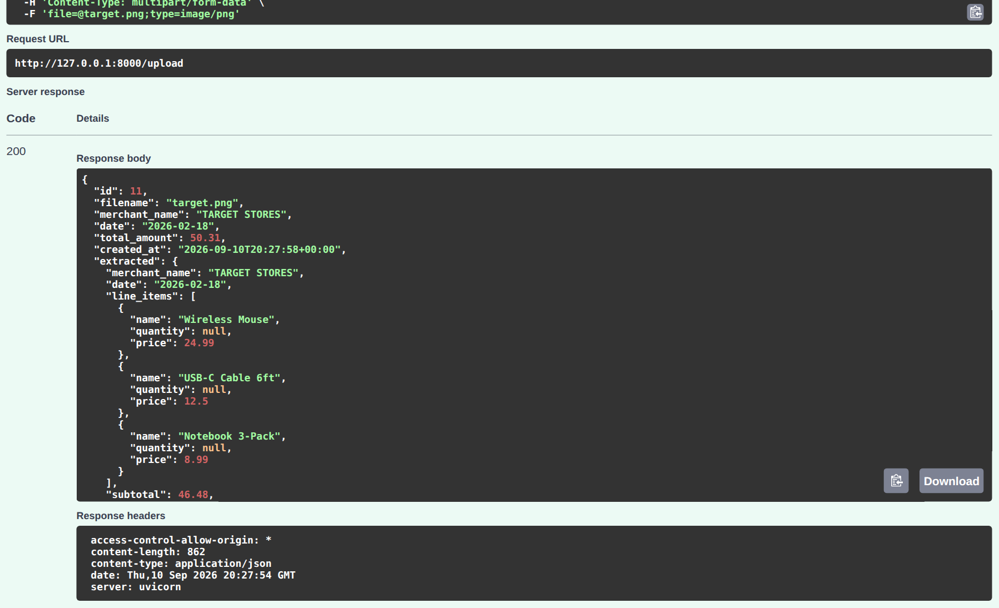

# ReceiptIQ — end-to-end receipt extraction

Upload a receipt (PNG / JPG / JPEG / PDF) → a **free, local** OCR + rules pipeline (optionally refined by a **free-tier** LLM) extracts merchant, date, line items, tax, tip and total → the record is persisted in **SQLite** → a web UI shows the result and every previously extracted receipt in a table.

Built for the *AI Engineer / Full-Stack ML Intern* take-home. Everything in the brief is covered:

| Requirement                                                                                                           | Where                                                                                                                                                                          |
| --------------------------------------------------------------------------------------------------------------------- | ------------------------------------------------------------------------------------------------------------------------------------------------------------------------------ |
| Upload UI with`.png/.jpg/.jpeg/.pdf`, status indicator (Idle / Loading / Success / Error), table of stored receipts | [`frontend/`](frontend/) (plain HTML/JS, no build step; visual style follows the [Acctual reference](https://styles.refero.design/style/aeefc294-a8f7-443d-b76a-538dddc29afe)) |
| `POST /upload` and `GET /receipts` in FastAPI                                                                     | [`backend/app/main.py`](backend/app/main.py)                                                                                                                                  |
| Extraction of merchant, date, line items (name, price), total, tax / tip                                              | [`backend/app/extraction/`](backend/app/extraction/)                                                                                                                          |
| Zero-cost inference (no paid keys)                                                                                    | RapidOCR (PaddleOCR models on ONNX Runtime, CPU) + rule-based parser; optional OpenRouter`:free` model                                                                       |
| SQLite table with`id, filename, merchant_name, date, total_amount, extracted_json, created_at`                      | [`backend/app/database.py`](backend/app/database.py)                                                                                                                          |
| Part 2 — Option A (bonus code)**and** Option B (design section)                                                | [`agents/expense_dispatcher.py`](agents/expense_dispatcher.py) and [Part 2 below](#part-2-multi-agent-architecture-design)                                                     |
| Verified against the three receipts in the brief                                                                      | [`backend/tests/`](backend/tests/) — 29 tests, all passing                                                                                                                   |

---

## Screenshots

All images below are real captures of the running app (`docs/screenshots/`), taken with headless Chrome against the sample receipts from the brief.

**Home — upload zone, status badge, and the stored-receipts table fed by `GET /receipts`**



**Upload result — the Quick-Mart fuel receipt after `POST /upload`: Success badge, merchant, date, total, tax, payment method, and both line items (including the wrapped `PUMP 04 … 12.4 GALLONS @ $3.25/GAL` description with quantity 12.4)**



**Stored receipts — every record from SQLite; clicking a row expands its line items, the `extracted_json` column, and the raw OCR text**



**Error state — a `.txt` file is rejected client-side and by the API (400)**



**Swagger UI at `/docs` — the auto-generated OpenAPI reference**



**Swagger "Try it out" — a live `POST /upload` of the Target receipt returning the persisted record (HTTP 200)**



---

## Quick start

```bash
git clone <this repo> && cd ReceiptIQ
./run.sh                 # creates .venv, installs requirements.txt, starts uvicorn on :8000
```

Then open **http://localhost:8000**. API docs are at **/docs**.

Manual equivalent:

```bash
python3 -m venv .venv && source .venv/bin/activate
pip install -r requirements.txt
uvicorn backend.app.main:app --reload
```

The first start downloads the OCR models (~15 MB) into the package cache; after that the app works fully offline. No API key is needed. Tested on Python 3.12–3.14, CPU only.

Docker: `docker build -t receiptiq . && docker run -p 8000:8000 -v receiptiq-data:/data receiptiq`

---

## Architecture

```
┌──────────────────────┐   multipart    ┌──────────────────────────┐
│  Frontend (HTML/JS)  │ ─────────────▶ │  FastAPI  POST /upload   │
│  drag-drop uploader  │                │           GET  /receipts │
│  status badge        │ ◀───────────── │           GET  /receipts/{id}
│  receipts table      │     JSON       │           DELETE /receipts/{id}
└──────────────────────┘                └────────────┬─────────────┘
                                                     │ run_in_threadpool
                                                     ▼
                      ┌──────────────────────────────────────────────────────┐
                      │ Extraction engine  (backend/app/extraction/)         │
                      │  preprocess.py  image/PDF → RGB pages (PyMuPDF)      │
                      │  ocr.py         RapidOCR boxes → physical lines      │
                      │  parser.py      rules/regex → ExtractedReceipt       │
                      │  llm.py         optional free OpenRouter refinement  │
                      └──────────────────────────┬───────────────────────────┘
                                                 ▼
                                  ┌──────────────────────────────┐
                                  │ SQLite  data/receipts.db     │
                                  │ id, filename, merchant_name, │
                                  │ date, total_amount,          │
                                  │ extracted_json, created_at   │
                                  └──────────────────────────────┘
```

```
ReceiptIQ/
├── backend/app/
│   ├── main.py            FastAPI routes, validation, static frontend
│   ├── config.py          env settings (.env loader, engine selection)
│   ├── database.py        sqlite3 schema + CRUD
│   ├── schemas.py         pydantic models (LineItem, ExtractedReceipt, ReceiptRecord)
│   └── extraction/        preprocess → ocr → parser → (llm) → pipeline
├── backend/tests/         pytest: parser, pipeline (real OCR on the 3 samples + PDF), API, LLM (mocked), agents
├── frontend/              index.html, app.js, styles.css
├── docs/screenshots/      real captures of the UI and Swagger used in this README
├── agents/                Part 2: expense_dispatcher.py, make_sample_recipients.py
├── data/                  (created at runtime, git-ignored) uploads/ + receipts.db
├── requirements.txt · run.sh · Dockerfile · .env.example
```

---

## REST API

| Method     | Path                             | Purpose                                                      |
| ---------- | -------------------------------- | ------------------------------------------------------------ |
| `POST`   | `/upload`                      | multipart`file` → extract → persist → return the record |
| `GET`    | `/receipts?limit=100&offset=0` | stored receipts, newest first (`{count, receipts:[…]}`)   |
| `GET`    | `/receipts/{id}`               | one record                                                   |
| `DELETE` | `/receipts/{id}`               | remove a record (204)                                        |
| `GET`    | `/health`                      | liveness, engine in use, receipt count                       |
| `GET`    | `/` , `/docs`                | frontend, Swagger UI                                         |

```bash
curl -F "file=@backend/tests/fixtures/corner_bistro.png" localhost:8000/upload
```

```json
{
  "id": 1, "filename": "corner_bistro.png", "merchant_name": "THE CORNER BISTRO",
  "date": "2026-02-20", "total_amount": 99.48, "created_at": "2026-09-10T19:16:17+00:00",
  "extracted": {
    "merchant_name": "THE CORNER BISTRO", "date": "2026-02-20",
    "line_items": [
      {"name": "Sparkling Water", "quantity": 1, "price": 4.0},
      {"name": "Caesar Salad",    "quantity": 2, "price": 22.0},
      {"name": "Grilled Salmon",  "quantity": 2, "price": 48.0},
      {"name": "Espresso",        "quantity": 1, "price": 3.5}
    ],
    "subtotal": 77.5, "tax": 6.98, "tip": 15.0, "total_amount": 99.48,
    "currency": "USD", "payment_method": null,
    "engine": "rapidocr+rules", "warnings": [], "raw_text": "THE CORNER BISTRO\n…"
  }
}
```

Validation: extension allow-list, magic-byte sniffing (a `.png` that isn't a PNG → 400), 10 MB cap (413), unreadable file (422). Extraction runs in a thread pool so the event loop stays responsive; the OCR model is loaded once at startup.

---

## Extraction engine

**Why this design.** The brief requires zero-cost inference. Hosted free tiers (Hugging Face Inference API, OpenRouter `:free` models) are rate-limited, rotate models, and need a key, so they can't be the thing the demo depends on. A local OCR engine is deterministic, offline and free forever. Tesseract needs a system package (no `sudo` on my machine, and a reviewer may not have it either); **RapidOCR** ships PaddleOCR's detection + recognition models as ONNX files installed by `pip`, runs on CPU in ~1–3 s per receipt, and is noticeably better than Tesseract on photographed thermal receipts. The LLM is therefore an *optional refinement layer*, never a dependency.

**Pipeline** (`backend/app/extraction/`):

1. **preprocess.py** — EXIF-rotate, convert to RGB, cap the long side at 2000 px and **upscale small images to 1600 px** (below ~600 px the recogniser drops the spaces between words, e.g. `1xSparklingWater`, `Date:Feb 20,2026`); PDFs are rasterised at 200 dpi with PyMuPDF (up to 5 pages).
2. **ocr.py** — RapidOCR returns *word boxes*, not lines. Receipts are two-column ("item …… price"), so boxes are clustered on their vertical centre (threshold 0.55 × median text height) and sorted left-to-right to rebuild physical lines. Stray `$` glyphs that the detector returns as tall column boxes are dropped.
3. **parser.py** — pure function `parse_receipt(lines) -> ExtractedReceipt`, fully unit-tested:
   * OCR repair only where unambiguous: `O↔0`, `l→1` inside numeric tokens (`PUMP O4` → `04`), stray `0`/`1` in words (`STATI0N` → `STATION`, `Gri1led` → `Grilled`), dropped spaces (`1xSparklingWater` → qty 1, `Sparkling Water`), and a 180°-rotated price read (`86'9 $` → `$6.98`).
   * Money = last `\d+\.\d{2}` token at the end of a line, so `12.4 GALLONS @ $3.25/GAL  40.30` yields 40.30 and `TAX (8.25%)` isn't mistaken for an amount.
   * Merchant = first header line that isn't decoration, an address, a phone, an order/table/station line or a date.
   * Date normalised to ISO from `Feb 20, 2026`, `02/18/2026`, `02-25-2026`, `2026-02-25`, `20.02.2026`, `3 March 2026` (day-first when the first field > 12).
   * Keyword tables for subtotal / tax (multiple tax lines are summed; `TAX INCLUDED IN FUEL` without an amount is ignored) / tip (`TIP`, `GRATUITY`, `SERVICE CHARGE`) / total (`TOTAL DUE|PAID`, `GRAND TOTAL`, `AMOUNT DUE` beat a bare `TOTAL`; fallback = largest amount, with a warning).
   * Line items = amount-bearing lines between the header block and the totals block, excluding payment/auth lines; `2x`, `x2`, `1.` and `12.4 GAL @ …` quantity forms are parsed; a wrapped description (`PUMP 04 REGULAR UNLEADED` + `12.4 GALLONS @ $3.25/GAL 40.30`) is merged.
   * Arithmetic checks (`subtotal + tax + tip = total`, `Σ items = subtotal`) produce **warnings**, never failures — the UI shows them so a human can review.
4. **llm.py** (optional) — if `OPENROUTER_API_KEY` is set, the OCR lines and the rules draft are sent to a free model (default `meta-llama/llama-3.3-70b-instruct:free`, configurable because free models rotate) with a strict JSON schema. The reply is validated with pydantic and merged field-by-field; any timeout, HTTP error or malformed JSON silently keeps the rules result. `engine` in the stored JSON records which path produced the answer.

**Results on the three receipts from the brief** (all via the live API, engine `rapidocr+rules`, no warnings):

| Receipt         | Merchant               | Date       | Items                       | Subtotal | Tax  | Tip   | Total | Time |
| --------------- | ---------------------- | ---------- | --------------------------- | -------- | ---- | ----- | ----- | ---- |
| Corner Bistro   | THE CORNER BISTRO      | 2026-02-20 | 4/4 ✓                      | 77.50    | 6.98 | 15.00 | 99.48 | ~3 s |
| Target          | TARGET STORES          | 2026-02-18 | 3/3 ✓ (+`VISA ****4012`) | 46.48    | 3.83 | —    | 50.31 | ~2 s |
| Quick-Mart Fuel | QUICK-MART FUEL & MORE | 2026-02-25 | 2/2 ✓ (qty 12.4 gal)       | —       | 0.28 | —    | 44.07 | ~2 s |

**Configuration** (`.env`, see `.env.example`):

| Variable                    | Default                                    | Meaning                                                                    |
| --------------------------- | ------------------------------------------ | -------------------------------------------------------------------------- |
| `EXTRACTION_ENGINE`       | `auto`                                   | `rules` (local only), `llm` (needs key), `auto` (llm if key present) |
| `OPENROUTER_API_KEY`      | —                                         | free key from openrouter.ai; only`:free` models are used                 |
| `OPENROUTER_MODEL`        | `meta-llama/llama-3.3-70b-instruct:free` | any free text model                                                        |
| `RECEIPTIQ_DATA_DIR`      | `./data`                                 | uploads + SQLite location                                                  |
| `RECEIPTIQ_MAX_UPLOAD_MB` | `10`                                     | upload cap                                                                 |

---

## Tests

```bash
.venv/bin/python -m pytest backend/tests -q      # 29 passed in ~25 s
```

| File                 | What it proves                                                                                                                                                  |
| -------------------- | --------------------------------------------------------------------------------------------------------------------------------------------------------------- |
| `test_parser.py`   | parser on the exact OCR text of the 3 samples + edge cases (no total keyword, summed taxes, thousands separators, mismatch warnings, date formats, OCR repairs) |
| `test_pipeline.py` | real OCR → parser on the 3 images, a 535×440 screenshot of one of them,**and** a PDF, asserting every ground-truth field with zero warnings             |
| `test_api.py`      | `/upload` → `/receipts` → `/receipts/{id}` → `DELETE`; PDF upload; rejection of wrong extension, spoofed content, empty file                         |
| `test_llm.py`      | OpenRouter refiner with a mocked transport: merge policy, fallback on 429 / garbage output, disabled without key                                                |
| `test_agents.py`   | Part 2 workflow end-to-end in dry-run: categorisation, duplicate detection, MD/HTML/CSV report,`.eml` output, invalid recipient skipped, date filter          |

---

## Part 2: Multi-Agent Architecture Design

**Scenario.** Extracted expense reports are processed by AI agents, composed into formal expense summaries and dispatched to the email recipients listed in an Excel sheet via Gmail/SMTP.

### What is implemented (Option A)

[`agents/expense_dispatcher.py`](agents/expense_dispatcher.py) is a working, framework-free implementation (custom Python agent classes + orchestrator). It is deliberately small so the design is readable in one file.

```bash
python -m agents.make_sample_recipients recipients.xlsx          # name | email | department
python -m agents.expense_dispatcher --recipients recipients.xlsx --dry-run --print-report
#   → prints the report, writes one .eml per recipient to outbox/ (open them in any mail client)
python -m agents.expense_dispatcher --recipients recipients.xlsx --since 2026-02-01 --until 2026-02-28
#   → real send through SMTP_HOST/SMTP_USER/SMTP_PASSWORD (Gmail app password), see .env.example
python -m agents.expense_dispatcher --recipients recipients.xlsx --api-url http://localhost:8000 --dry-run
#   → fetch from the running API instead of reading the SQLite file directly
```

```
                ┌────────────────────────────── WorkflowState (shared, typed) ───────────────────────────────┐
                │ receipts[] → analysis{} → summary_markdown/html/csv + subject → recipients[] → dispatched[]   │
                └──────────────────────────────────────────────────────────────────────────────────────────────┘
   ┌─────────────┐    ┌──────────────┐    ┌───────────────┐    ┌────────────────┐
   │ Fetcher     │ ─▶ │ Analyst      │ ─▶ │ Composer      │ ─▶ │ Dispatcher     │
   │ SQLite or   │    │ categorise   │    │ formal report │    │ Excel → SMTP   │
   │ GET /receipts    │ anomalies    │    │ MD + HTML +   │    │ (Gmail) or     │
   │ date filter │    │ aggregates   │    │ CSV attachment│    │ --dry-run .eml │
   │ retry ×3    │    │ LLM narrative│    │               │    │ retry ×3       │
   └─────────────┘    └──────────────┘    └───────────────┘    └────────────────┘
                         Orchestrator: sequential, per-agent retry with back-off, run log, fail-fast on AgentError
```

| Agent                     | Responsibility                                                                                                                                                                                                                                                                  | Deterministic core | Optional LLM                                                                              |
| ------------------------- | ------------------------------------------------------------------------------------------------------------------------------------------------------------------------------------------------------------------------------------------------------------------------------- | ------------------ | ----------------------------------------------------------------------------------------- |
| **FetcherAgent**    | Load receipts (SQLite directly or the REST API), apply`--since/--until`                                                                                                                                                                                                       | SQL / HTTP         | —                                                                                        |
| **AnalystAgent**    | Category per receipt (dining / fuel / retail / travel / groceries / other); anomaly flags: missing fields, arithmetic mismatch from the extractor's warnings, tip > 25 % of subtotal, > $500 needs approval, duplicate (merchant, date, total); totals by category and merchant | keyword rules      | one-paragraph narrative for the report (free OpenRouter model), with a templated fallback |
| **ComposerAgent**   | Formal expense summary: header, narrative, category table, per-receipt table with flags, "items requiring review"; rendered as Markdown, HTML and a CSV of line items                                                                                                           | string templates   | — (could draft the cover note)                                                           |
| **DispatcherAgent** | Read`name / email / department` from `.xlsx` (openpyxl), validate addresses, build a `multipart/alternative` email with CSV attachment, send via SMTP with STARTTLS (or SSL on 465); `--dry-run` writes `.eml` files instead                                          | smtplib            | —                                                                                        |

Every agent has a single input/output contract on `WorkflowState`, so each can be unit-tested alone (see `test_agents.py`) and the LLM can be switched off without changing behaviour — that was the most important design choice: **the LLM adds prose, never numbers.** Money is always computed in Python.

### How I would grow it into a production system

1. **Trigger & scheduling.** Run as a scheduled job (cron / Celery beat / GitHub Actions) at month end, or event-driven: the API emits a `receipt.extracted` event to a queue (Redis Streams / SQS) and the workflow batches per employee. Idempotency key = (employee, period) so a rerun never double-sends.
2. **Human in the loop.** The Analyst's flags become a review queue in the UI (approve / edit / reject) before the Composer runs; corrections are written back to `extracted_json` and used as evaluation data for the extractor.
3. **Policy agent.** Add a `PolicyAgent` between Analyst and Composer that checks company rules (per-diem caps, receipt required above X, category allow-lists) and produces reimbursable vs non-reimbursable totals. Rules live in YAML; an LLM explains *why* an item was rejected.
4. **Recipient routing.** The Excel `department` column selects which slice of the report each person receives (managers get their team, finance gets everything). The sheet is a stop-gap: in production recipients come from HRIS/Okta and the sheet becomes an override list.
5. **Delivery.** Gmail API with OAuth service account instead of SMTP app passwords; retries with exponential back-off; bounce handling; store a `dispatch_log` table (recipient, message-id, status) so the run is auditable and resumable.
6. **Framework choice.** For this size a plain orchestrator is clearer than a framework. If the graph grows (branches, parallel per-employee fan-out, approvals that pause for days) I would move to **LangGraph**: each `run()` becomes a node, `WorkflowState` becomes the graph state, and checkpointing gives pause/resume for the approval step. CrewAI/AutoGen add conversational overhead that this pipeline doesn't need.
7. **Safety.** Prompt inputs are OCR text from user uploads — treat as untrusted (prompt injection). Keep LLM output schema-validated, never executable, and never let it set amounts. Secrets only via environment / a secrets manager; PII (card last-4, names) redacted from logs and from LLM prompts where not needed.
8. **Observability.** Per-agent timings and outcomes already go to the run log; ship them to OpenTelemetry, alert on dispatch failures, and track extractor quality (share of receipts with warnings) as a KPI.

---

## Limitations & ideas for the discussion

* **Layout assumptions.** The parser assumes a single price column at the right. Multi-column supermarket receipts (qty × unit = total on the same line) mostly work via the "last amount on the line" rule, but split-line prices ("2 @ 3.00" on one line, total on the next) would need a small layout model or the LLM path.
* **Currency & locales.** Detects `$ € £ ₹`; European `1.234,56` formatting is not yet handled. Dates default to month-first when ambiguous — should be a per-tenant setting.
* **Vision models.** A free VLM (Qwen2-VL via Hugging Face, `llama-3.2-11b-vision-instruct:free` on OpenRouter) could read the image directly and would beat OCR on handwritten or heavily crumpled receipts; I kept it out because free vision endpoints were too unreliable to demo on, but `llm.py` is the seam where it plugs in (send the image instead of the OCR lines).
* **Evaluation.** Ground truth for 3 receipts lives in the tests. Next step: a labelled set of 50–100 receipts (SROIE / CORD datasets are public) with per-field accuracy reported in CI, so parser tweaks can't silently regress.
* **Product extras that are cheap to add:** batch upload and background jobs with progress, duplicate detection at upload time, inline editing of extracted fields (feeds the eval set), export to CSV/Excel, search/filter in the table, per-user auth, thumbnails of the stored image.

---

## How I used Claude Code

I used Claude Code as a pair programmer, the way the brief suggests: I set the constraints (free-only inference, no system packages, Python 3.14 on my machine, exact schema from the PDF), had it verify the environment before choosing the OCR engine, and iterated on the parser against the *real* OCR output of the three sample receipts rather than idealised text. The ground-truth tests were written before the parser was tuned, and every claim in this README (accuracy table, API sample, UI behaviour) was produced by running the code — including a headless-browser check of the upload → Success → table flow.
